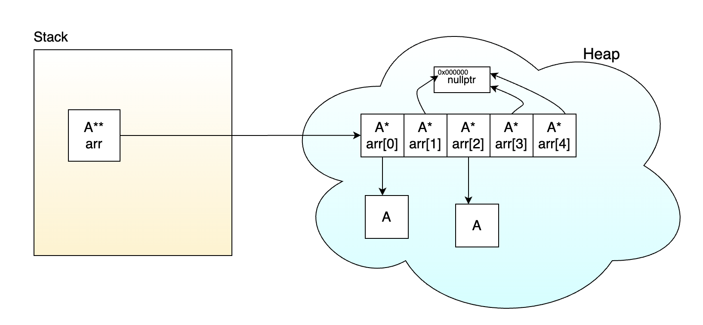

# 07. Колекции от обекти. Масиви от указатели към обекти. Move семантики. Rule of Five

## Колекции от обекти

Когато в една програма трябва да се пази колекция от много елементи от един и същи тип, има няколко основни начина това да се направи. Най-естественият вариант е да се пазят **самите обекти** един след друг в масив. Друг подход е да се пазят **указатели към обекти**, а самите обекти да се създават отделно в динамичната памет.

Тези два подхода не са еквивалентни. Те се различават по няколко важни свойства:

- какво точно се заделя в паметта
- кога се създават и унищожават обектите
- колко скъпо е разширяването на колекцията
- дали могат да съществуват „празни места“
- колко ефективно се обхождат елементите

Масивът от обекти обикновено е по-лесен за работа и по-ефективен при последователно обхождане, защото елементите са разположени един до друг в паметта. От друга страна, масивът от указатели дава повече гъвкавост. При него не е необходимо всеки елемент да бъде създаден веднага, може да има клетки със стойност `nullptr`, а при някои задачи това е удобно и откъм логика, и откъм използвана памет. Ако например в даден момент само част от позициите съдържат реални обекти, няма нужда да създаваме всички останали предварително.

Именно затова е важно да се прави ясна разлика между:

- **масив от обекти**
- **масив от указатели към обекти**

Да разгледаме различните варианти за пазене на подобни колекции.

## Mасив от обекти (с фиксиран размер, не динамично заделен)

```cpp
class A
{
public:
    A()
    {
        std::cout << "A()\n";
    }

    ~A()
    {
        std::cout << "~A()\n";
    }
};

int main()
{
    A arr[5];
}
```

Тук се създава **масив от 5 обекта от тип `A`**. 

При създаването на `arr` се извиква конструкторът по подразбиране 5 пъти — по веднъж за всеки елемент. Когато приключи обхвата на `main`, се извикват и 5 деструктора.

Този подход е много естествен, защото:
- структурата е проста
- не се налага ръчно управление на памет
- обектите са последователно разположени в паметта

Последното е особено важно за производителността. Когато обектите са един до друг, процесорът може да ги обхожда по-ефективно. Това свойство често се нарича **locality of reference** или накратко **locality**.

Недостатъкът е, че за да се създаде такъв масив, типът `A` **трябва да има** достъпен конструктор по подразбиране. Освен това всички 5 обекта съществуват още от началото, дори ако логически в програмата се използват само някои от тях.

## Масив от указатели към обекти (с фиксиран размер, не динамично заделен)

```cpp
class A
{
public:
    A()
    {
        std::cout << "A()\n";
    }

    ~A()
    {
        std::cout << "~A()\n";
    }
};

int main()
{
    A* arr[5] = { nullptr };

    arr[0] = new A();
    arr[2] = new A();

    delete arr[0];
    delete arr[2];
}
```

Тук ситуацията е различна. Създава се **масив от 5 указателя към `A`**, а не масив от 5 обекта от тип `A`.

Това означава, че самият масив съдържа само адреси. В началото тези адреси са инициализирани с `nullptr`, тоест съответните клетки не сочат към никакъв обект. След това само на позиции `0` и `2` се създават реални обекти в динамичната памет и само за тях се извикват съответните конструктори. 

Едно от предимствата тук е, че **не е** задължително класът `A` да има default-ен конструктор.

Тази идея е много важна: при масив от указатели е напълно възможно част от клетките да са „празни“. Това в някои задачи е голямо предимство. Например:
- може да се пази частично запълнена колекция
- може да се представя структура с дупки
- не е нужно да се създават обекти за всички позиции предварително

Това понякога води и до спестяване на памет. Ако дадена задача изисква капацитет за 100 позиции, но в даден момент реално съществуват само 10 обекта, при масив от указатели могат да бъдат създадени само тези 10 обекта, а останалите клетки да са `nullptr`.

Тук обаче трябва да се внимава с една често срещана грешка.

Следният код:

```cpp
A* arr[5];
```

**не** означава, че елементите на масива са `nullptr`. Това са **неинициализирани указатели**, които съдържат неопределени стойности. Ако искаме безопасно начално състояние, трябва да ги инициализираме изрично, например така:

```cpp
A* arr[5] = { nullptr };
```

## Динамично заделен масив от обекти

```cpp
class A
{
public:
    A()
    {
        std::cout << "A()\n";
    }

    ~A()
    {
        std::cout << "~A()\n";
    }
};

int main()
{
    A* arr = new A[5];
    delete[] arr;
}
```


Тук се създава **динамичен масив от 5 обекта от тип `A`**.

Променливата `arr` е указател към първия елемент на този масив, но това не трябва да заблуждава: става дума за масив от обекти, не за масив от указатели.

При `new A[5]`:
- заделя се памет за 5 обекта
- извиква се конструкторът по подразбиране 5 пъти

При `delete[] arr`:
- се извиква деструкторът за всеки елемент
- след това паметта за целия масив се освобождава

Този подход има същите основни свойства като статичния масив от обекти:
- добро locality
- обектите са разположени един до друг в паметта
- лесно обхождане

Предимството спрямо масивът от обекти, който не е заделен динамично, е че тук можем да заделим с размер, който става ясен по време на изпълнение на програмата (runtime).

Но отново има и същото ограничение: всички обекти трябва да бъдат създадени веднага, а това изисква задължително достъпен default constructor.

## Динамичен масив от указатели към обекти

```cpp
class A {
public:
    A() {
        std::cout << "A()\n";
    }

    ~A() {
        std::cout << "~A()\n";
    }
};

int main() {
    A** arr = new A*[5] { nullptr };

    arr[0] = new A();
    arr[2] = new A();

    delete arr[0];
    delete arr[2];
    delete[] arr;
}
```


Тук `arr` е указател към първия елемент на **динамичен масив от указатели към `A`**. Това означава, че в паметта първо съществува масив, чиито елементи са от тип `A*`. След това някои от тези указатели могат да сочат към отделно създадени обекти.

При тази организация има две отделни нива:
- масивът от указатели
- реалните обекти, към които сочат някои от указателите

Това прави структурата по-гъвкава, но и по-сложна за управление. Освобождаването на ресурсите трябва да стане на два етапа:
1. всеки създаден обект трябва да бъде изтрит с `delete`
2. самият масив от указатели трябва да бъде изтрит с `delete[]`

Този модел е полезен, когато:
- не искаме всички елементи да съществуват от самото начало
- искаме да допускаме празни клетки (`nullptr`)
- типът няма default constructor
- искаме по-евтино разместване и resize

Цената за това е, че управлението на паметта става по-трудно и рискът от грешки се увеличава.

---

## Сравнение: масив от обекти и масив от указатели към обекти (`A*` vs. `A**`)

Най-важната разлика не е в синтаксиса `A*` срещу `A**`, а в това **какво точно се пази в колекцията**.

## Вариант 1: динаимчен масив от обекти

```cpp
class Box
{
    int value = 0;
};

Box* data = new Box[8];
int size = 0;
int capacity = 8;
```

Тук `data[i]` е реален обект от тип `Box`.

Ако се добави нов елемент:

```cpp
void add(const Box& obj)
{
    if (size == capacity)
    {
        resize();
    }

    data[size++] = obj;
}
```

то той се копира в следващата свободна клетка. Ако масивът се запълни, трябва да се създаде по-голям масив и елементите да бъдат прехвърлени в него.

При тази реализация:
- обектите са последователни в паметта
- обхождането е ефективно
- достъпът е директен
- структурата е сравнително проста

Но има и недостатъци:
- при resize се местят или копират **самите обекти** с deep copy
- трябва да съществува default constructor
- дори неизползваните позиции са заети от реални обекти

Тоест тук плащаме повече при разширяване на колекцията, но печелим по-добро поведение при обхождане.

## Вариант 2: динамичен масив от указатели към обекти

```cpp
class Box
{
    int value = 0;
};

Box** data = new Box*[8] { nullptr };
int size = 0;
int capacity = 8;
```

Тук `data[i]` е указател към обект от тип `Box`.

Добавянето на нов елемент може да изглежда така:

```cpp
void add(const Box& obj)
{
    if (size == capacity)
    {
        resize();
    }

    data[size++] = new Box(obj);
}
```

Сега самият масив съдържа само указатели. При resize не е нужно да се местят обектите, а само указателите към тях. Това е съществено предимство, ако обектите са тежки откъм копиране или _move операции_.

```cpp
void resize(int newCap)
{
	А** resized = new A*[newCap] {nullptr};
	for (int i = 0; i < capacity; i++)
	{
		resized[i] = arr[i]; // new pointers point to same addresses
	}
	delete[] arr; // this deletes only the old pointers, not the actual objects
	arr = resized;
	capacity = newCap;
}
```
Тоест при resize вместо да правим deep copy, просто насочваме новите указатели от resize-натия масив от указатели, към същите адреси.


Освен това този вариант допуска клетки със стойност `nullptr`. Това означава, че колекцията може да има „празни места“. В някои задачи това е особено удобно, например ако:
- елементите се създават постепенно
- има логически празни позиции
- не искаме да държим излишно голям брой реални обекти

Тук може да има и предимство откъм памет. Ако капацитетът е голям, но реално заети са малко клетки, тогава масивът от указатели заема място за указатели, а обекти се създават само там, където действително са нужни.

Този подход обаче има и важни недостатъци:
- обектите вече не са разположени последователно в паметта
- locality е по-лошо
- обхождането обикновено е по-бавно
- има повече работа по освобождаване на паметта
- рискът от memory leak е по-голям

Следователно масивът от указатели не е универсално по-добро решение. Той е полезен, когато се търси гъвкавост и евтино разместване, но не и когато основната цел е максимално бързо обхождане.

## Освобождаване на ресурсите

При масив от обекти:

```cpp
delete[] data;
```

Това е достатъчно, защото `delete[]` ще извика деструктор за всеки елемент от масива.

При масив от указатели:

```cpp
for (int i = 0; i < size; i++)
{
    delete data[i];
}

delete[] data;
```

Тук `delete[] data` освобождава само масива от указатели. То не унищожава автоматично обектите, към които тези указатели сочат. Затова първо трябва да бъдат изтрити самите обекти.

Ако някои клетки са `nullptr`, `delete data[i]` е безопасно, защото `delete nullptr` не прави нищо.

---
---


# Move семантики

Когато един обект владее ресурс, копирането му често е скъпа операция. Ако например един клас пази динамично заделена памет, при копиране обикновено трябва да се направи **deep copy**. Това означава:
- ново заделяне на памет
- копиране на съдържанието
- поддържане на два независими обекта

Но понякога работим не с обект, който ще продължи да се използва, а с **временен обект**. В такъв случай е по-изгодно да се прехвърли ownership-ът (притежанието) на ресурса, вместо той да се копира. Точно тази идея стои зад move семантиките.

## lvalue и rvalue

Най-общо:
- **lvalue** е израз, който има идентичност в програмата, има адрес и име
- **rvalue** е временна стойност

```cpp
int x = 10;
x = 20;
```

Тук `x` е lvalue.

```cpp
int globalValue = 0;

int& getRef()
{
    return globalValue;
}

int main()
{
    getRef() = 5;
}
```

Резултатът от `getRef()` също е lvalue, защото функцията връща референция към съществуващ обект.

За разлика от това:

```cpp
int getValue()
{
    return 5;
}

int main()
{
    // getValue() = 10;  // грешка
}
```

тук резултатът от `getValue()` е временна стойност.

Това разграничение е важно, защото копиращите и *местещите* операции се избират именно според това каква категория стойност е аргументът.

## Кои функции могат да приемат временни обекти

Нека за даден клас `A` имаме следните функции:

```cpp
void f(A obj);
void g(A& obj);
void h(const A& obj);
void k(A&& obj);
```

Тогава:
- `f(A obj)` може да се извика и с lvalue, и с rvalue, защото параметърът се предава по стойност
- `g(A& obj)` може да се извика само с lvalue
- `h(const A& obj)` може да се извика и с lvalue, и с rvalue
- `k(A&& obj)` може да се извика само с rvalue

Това означава, че **константна lvalue референция** може да се върже към временен обект. Именно затова copy constructor с параметър `const A&` може да се извика и върху временен обект.

Например:

```cpp
class A
{
public:
    A() = default;

    A(const A&)
    {
        std::cout << "copy constructor\n";
    }
};

A create()
{
    return A();
}

int main()
{
    A a = create();
}
```

Ако няма move constructor, временният обект може да бъде копиран чрез copy constructor-а, който приема `const A&`.

Същото важи и за copy assignment operator с параметър `const A&`:

```cpp
class A
{
public:
    A& operator=(const A&)
    {
        std::cout << "copy assignment\n";
        return *this;
    }
};

A create()
{
    return A();
}

int main()
{
    A obj;
    obj = create();
}
```

И тук временният обект може да се подаде на `operator=(const A&)`, защото `const A&` може да се върже към rvalue.

Дори без дефинирани move операции, временните обекти не са „неизползваеми“. Те могат да бъдат копирани. Move семантиките не правят нещо принципно възможно за пръв път, а предлагат **по-ефективен начин** за работа с временни обекти.

## rvalue reference

C++11 въвежда нов вид референция:

```cpp
A&&
```

Това е **rvalue reference**. Тя се използва, за да се разпознават обекти, от които може безопасно да се мести ресурс.

```cpp
int x = 42;

int& ref1 = x;     // позволено
// int&& ref2 = x; // грешка
int&& ref3 = 5;    // позволено
```

Идеята е, че rvalue reference се свързва с временни стойности или с обекти, които изрично са били обозначени като подходящи за местене.

Понякога се използва и терминът **xvalue**. Това е специален вид rvalue — стойност, която все още е свързана с конкретен обект, но от която вече е позволено да се „премести“. Точно такъв резултат връща `std::move(obj)`.

## `std::move`

`std::move` е едно от най-често използваните, но и едно от най-често неразбираните средства в move семантиките.

Това, което `std::move` прави, е да преобразува даден израз в такъв, който може да бъде третиран като rvalue. По-точно, то превръща lvalue израз в **xvalue**. С други думи, то казва:

> този обект може да бъде използван като източник за move операция

Например:

```cpp
int x = 5;
// int&& r1 = x;           // грешка
int&& r2 = std::move(x);   // позволено
```

Тук `x` е lvalue, защото е именувана променлива. След `std::move(x)` той се разглежда като xvalue и вече може да се върже към `int&&`.

На практика `std::move` е cast. То не мести данни, не освобождава ресурс и не променя само по себе си обекта. Реалното местене става едва ако след това бъде извикан **move constructor** или **move assignment operator**.

## Именувана rvalue reference е lvalue

Това е важен детайл, който обяснява защо `std::move` често трябва да се извика изрично.

Нека има функция:

```cpp
void add(const A&& obj)
{
    // obj is lvalue inside the function, so we need to convert it to rvalue reference / xvalue
    arr[size++] = std::move(obj);
}
```

Макар че типът на `obj` е `A&&`, вътре в тялото на функцията самото `obj` е именувана променлива. Следователно в рамките на функцията, то е lvalue.

Това означава, че ако вътре просто се използва `obj`, няма автоматично да се извика move операция. Ако е необходимо местене, трябва изрично да се напише `std::move(obj)`.

Този детайл обяснява защо в move constructor-и, move assignment оператори и overload-и от вида `f(A&&)` почти винаги се среща `std::move`.

### Какво може да се очаква след `std::move`

След като върху даден обект е приложено `std::move` и от него е извършено местене, той трябва да остане **валиден**, но съдържанието му обикновено е в **неуточнено състояние**. Това означава:
- обектът може безопасно да бъде унищожен
- върху него може да се присвои нова стойност
- не трябва да се разчита на старата му стойност

## Помощни функции `copyFrom` и `moveFrom`

Когато един клас управлява ресурс, често е удобно логиката за копиране и логиката за местене да бъдат изнесени в помощни функции. Така кодът става по-кратък и по-лесен за четене.

Идеята на `copyFrom(const Buffer& other)` е да създаде **независимо копие** на ресурса на `other`.

Идеята на `moveFrom(Buffer&& other)` е да **открадне** ресурсите на `other`, вместо да ги копира. Това означава:
- текущият обект взима указателя и размера
- `other` се оставя в безопасно състояние, така че унищожаването му по-късно да не доведе до проблем

Понеже параметърът `other` в move constructor-а и move assignment operator-а има име, той е lvalue в тялото на функцията. Затова когато го подаваме към `moveFrom`, трябва изрично да използваме `std::move(other)`.

## Move constructor

Move constructor се извиква, когато се създава нов обект от rvalue.

```cpp
class Buffer
{
    int* data = nullptr;
    std::size_t size = 0;

    void free()
    {
        delete[] data;
        data = nullptr;
        size = 0;
    }

    void copyFrom(const Buffer& other)
    {
        data = new int[other.size];
        size = other.size;

        for (std::size_t i = 0; i < size; i++)
        {
            data[i] = other.data[i];
        }
    }

    void moveFrom(Buffer&& other)
    {
        data = other.data;
        size = other.size;

        other.data = nullptr;
        other.size = 0;
    }

public:
    Buffer() = default;

    Buffer(std::size_t n) : data(new int[n]), size(n) {}

    ~Buffer()
    {
        free();
    }

    Buffer(const Buffer& other)
    {
        copyFrom(other);
    }

    Buffer(Buffer&& other) noexcept
    {
        moveFrom(std::move(other));
    }
};
```

Тук move constructor-ът не заделя нова памет и не копира елементите. Вместо това той "открадва" данните на временния обект:
- взима указателя към паметта на `other`
- взима размера
- занулява `other`

Точно това е move: ресурсът се прехвърля, а не се копира.

## Move assignment operator=

Move assignment operator се използва, когато текущият обект вече съществува и трябва да приеме ресурсите на друг rvalue обект.

```cpp
class Buffer
{
    int* data = nullptr;
    std::size_t size = 0;

    void free()
    {
        delete[] data;
        data = nullptr;
        size = 0;
    }

    void copyFrom(const Buffer& other)
    {
        data = new int[other.size];
        size = other.size;

        for (std::size_t i = 0; i < size; i++)
        {
            data[i] = other.data[i];
        }
    }

    void moveFrom(Buffer&& other)
    {
        data = other.data;
        size = other.size;

        other.data = nullptr;
        other.size = 0;
    }

public:
    Buffer() = default;

    Buffer(std::size_t n) : data(new int[n]), size(n) {}

    ~Buffer()
    {
        free();
    }

    Buffer(const Buffer& other)
    {
        copyFrom(other);
    }

    Buffer(Buffer&& other) noexcept
    {
        moveFrom(std::move(other));
    }

    Buffer& operator=(const Buffer& other)
    {
        if (this != &other)
        {
            free();
            copyFrom(other);
        }

        return *this;
    }

    Buffer& operator=(Buffer&& other) noexcept
    {
        if (this != &other)
        {
            free();
            moveFrom(std::move(other));
        }

        return *this;
    }
};
```

Тук има още един важен момент. При move assignment текущият обект вече държи ресурс. Затова този ресурс първо трябва да бъде освободен, а след това да се прехвърли ownership-ът от `other`.

## Защо move операциите често се маркират с `noexcept`

В много примери move constructor и move assignment оператор се пишат така:

```cpp
Buffer(Buffer&& other) noexcept;
Buffer& operator=(Buffer&& other) noexcept;
```

`noexcept` означава, че функцията няма да хвърли изключение.

Това е полезно по две причини.

Първо, то описва правилно намерението на функцията. Една move операция, която просто прехвърля указатели и занулява стария обект, обикновено няма основание да хвърля изключение.

Второ, и това е по-важната причина, стандартната библиотека използва тази информация. Ако move constructor не е `noexcept`, в някои ситуации може да се избере копиране вместо местене.

Разбира се, `noexcept` трябва да се поставя само когато наистина е вярно, че функцията не хвърля изключения.

## Добавяне на елементи към колекция чрез copy и move

Един и същ интерфейс може да има две версии:

```cpp
void add(const Buffer& obj)
{
    data[size++] = obj; // op=
}

void add(Buffer&& obj)
{
    data[size++] = std::move(obj); // move op=
}
```

Първата версия работи с lvalue аргументи и извършва копиране. Втората работи с rvalue аргументи и извършва местене.

Това е практическата сила на move семантиките. Не е нужно да се избира само един вариант. Ако се подаде обект, който трябва да остане непроменен, той се копира. Ако се подаде временен обект или обект, от който вече няма да се използва старото състояние, ресурсът може да бъде преместен.

## Кога компилаторът създава move операции автоматично

Компилаторът **може** да синтезира move constructor и move assignment operator, но това не се случва винаги.

Най-общата идея е следната:
- ако класът няма потребителски дефинирани copy операции, move операции или деструктор, компилаторът може да генерира move операции
- ако някой от членовете на класа не може да бъде преместен, съответната move операция може да бъде дефинирана като изтрита
- ако класът има ръчно дефиниран copy constructor, copy assignment operator или destructor, move операциите обикновено вече няма да бъдат автоматично генерирани

Затова при класове, които управляват ресурс, обикновено се мисли за т.нар. **Rule of Five**:
- деструктор
- copy constructor
- copy assignment operator
- move constructor
- move assignment operator

Ако един от тези специални членове се налага да бъде дефиниран ръчно, често трябва да се помисли и за останалите.

## Какво става, ако няма дефинирани move операции

Ако даден клас няма move constructor и move assignment operator, това не означава, че rvalue обектите не могат да се използват. Те могат да се свържат с `const A&`, затова в такива ситуации обикновено се извикват copy операциите.

Например:
- временен обект може да бъде копиран чрез `A(const A&)`
- временен обект може да бъде присвоен чрез `operator=(const A&)`

Тоест move операциите не са задължителни за коректност, а за **ефективност и оптималност**. Те позволяват да се избегне скъпото копиране тогава, когато източникът така или иначе е временен или вече няма да ни е нужен в старото си състояние.
